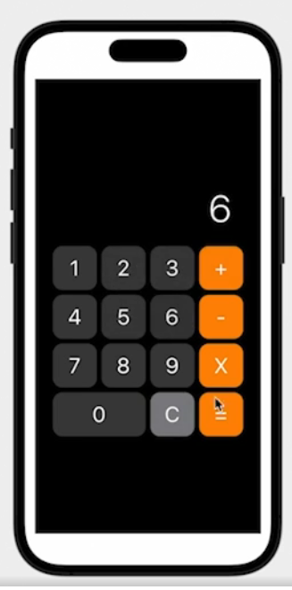

# Calculator App in SwiftUI

This is a simple calculator application built using SwiftUI. The application features a user-friendly interface with basic arithmetic operations including addition, subtraction, and multiplication.

## Features

- **Basic Operations**: Perform addition, subtraction, and multiplication.
- **Clear Functionality**: Clear the current input.
- **Responsive Design**: Adapts to different screen sizes.

## File Structure

The app consists of several Swift files, each responsible for different components of the calculator:

1. **CalculatorApp.swift**: The main entry point of the application.
2. **ContentView.swift**: The primary view that arranges the calculator's layout.
3. **ButtonGrid.swift**: Contains the layout and functionality of the calculator buttons.
4. **CalculatorButton.swift**: Defines the appearance and behavior of individual buttons.
5. **TotalText.swift**: Displays the current total value on the screen.

## Calculator Preview
